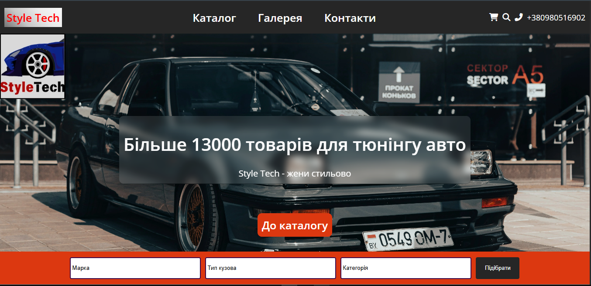

# Style Tech:  E-commerce Landing Page (Auto Tuning)

This project is a static, multi-section landing page for an auto tuning parts store ("Style Tech"). It showcases advanced **HTML5** and **CSS3** techniques, focusing on modern design principles, **full responsiveness**, efficient layout management, and user experience.

## Key Technical Highlights

The implementation demonstrates proficiency in the following front-end development areas:

1.  **Full Responsive Web Design (RWD):**
    * **Media Queries:** Implemented comprehensive media queries at **768px** and **600px** breakpoints to ensure optimal viewing across all devices.
    * **Mobile-First Adaptations (<= 600px):** The layout completely reflows for mobile:
        * The header switches to a **column layout** (`flex-direction: column`) with rearranged navigation.
        * Product filters (`.filters`) wrap and take **full width (`100%`)**, making them easy to use on touch devices.
        * The catalogue (`.catalog`) switches to a single-column layout (`minmax(100%, 1fr)`), ensuring a clean, mobile-friendly product display.
    * **Header and Utility Refinements:** The phone number is hidden (`display: none`) on small screens to prioritize space for core navigation and icons.

2.  **Modern CSS Layouts:**
    * **CSS Grid:** Utilized for defining the main page structure using `grid-template-areas` and for creating a robust, responsive product catalogue.
    * **Aesthetic Styling:** Product cards use **Glassmorphism** (`backdrop-filter: blur(8px)`) and smooth hover effects (`transform: scale(1.08)`).

3.  **Form & Input Handling:**
    * Designed a sticky, visually distinct **filter bar** (`.filters`) using a custom background color and custom-styled dropdowns (`.dropdown`) for enhanced usability.

4.  **Code Organization & Assets:**
    * Styles are separated into dedicated, modular CSS files (including `adaptive.css`) for maintainability.
    * Integration of Google Fonts and **Font Awesome** icons.

## Technologies Used

* **HTML5** (Semantic Structure)
* **CSS3** (Grid, Flexbox, Animations, **Media Queries**)
* **Font Awesome** (Icons)

## Screenshots 

Include a screenshot of the main page.



## How to Run the Project

This is a static website and requires no server-side setup.
It is already on github.pages

1.  **Follow the link:**
    ```bash
    https://evgenreva1986-cmd.github.io/Tuning_Landing_Page/
    ```

